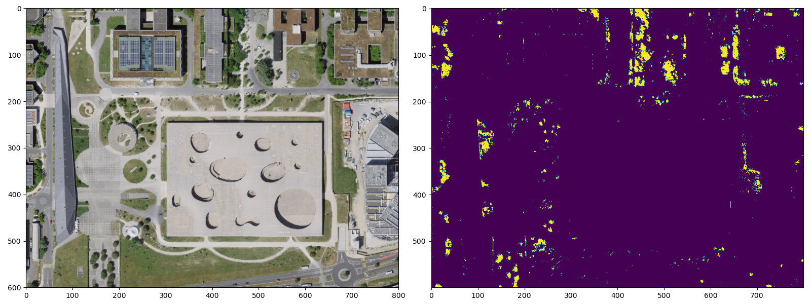
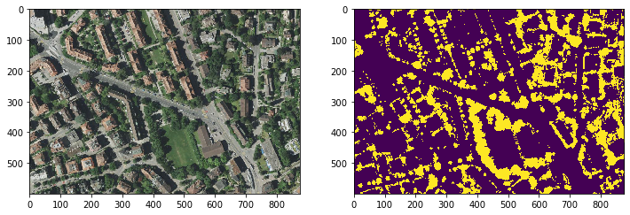

[](https://pypi.python.org/pypi/detectree/)
[](https://anaconda.org/conda-forge/detectree)
[](https://detectree.readthedocs.io/en/latest/?badge=latest)
[](https://github.com/martibosch/detectree/blob/main/.github/workflows/tests.yml)
[](https://results.pre-commit.ci/latest/github/martibosch/detectree/main)
[](https://codecov.io/gh/martibosch/detectree)
[](https://github.com/martibosch/detectree/blob/master/LICENSE)
[](https://doi.org/10.21105/joss.02172)
[](https://doi.org/10.5281/zenodo.3908338)

# DetecTree

## Overview

DetecTree is a Pythonic library to perform semantic segmentation of aerial imagery into tree/non-tree pixels, following the methods of Yang et al. \[1\]. A pre-trained model is available at [Hugging Face hub](https://huggingface.co/martibosch/detectree), which can be used as follows:

```python
from urllib import request

import detectree as dtr
import matplotlib.pyplot as plt
import rasterio as rio
from rasterio import plot

# download a tile from the SWISSIMAGE WMS
tile_url = (
    "https://wms.geo.admin.ch/?SERVICE=WMS&REQUEST=GetMap&VERSION=1.3.0&"
    "FORMAT=image/png&LAYERS=ch.swisstopo.images-swissimage&CRS=EPSG:2056"
    "&BBOX=2532980,1152150,2533380,1152450&WIDTH=800&HEIGHT=600"
)
tile_filename = "tile.png"
request.urlretrieve(tile_url, tile_filename)

# use the pre-trained model to segment the image into tree/non-tree-pixels
y_pred = dtr.Classifier().predict_img(tile_filename)

# side-by-side plot of the tile and the predicted tree/non-tree pixels
figwidth, figheight = plt.rcParams["figure.figsize"]
fig, axes = plt.subplots(1, 2, figsize=(2 * figwidth, figheight))
with rio.open(tile_filename) as src:
    plot.show(src, ax=axes[0])
axes[1].imshow(y_pred)
```



Alternatively, you can use detectree to train your own model on your aerial imagery dataset:

```python
import detectree as dtr
import matplotlib.pyplot as plt
import rasterio as rio
from rasterio import plot

# select the training tiles from the tiled aerial imagery dataset
ts = dtr.TrainingSelector(img_dir='data/tiles')
split_df = ts.train_test_split(method='cluster-I')

# train a tree/non-tree pixel classifier
clf = dtr.ClassifierTrainer().train_classifier(
    split_df=split_df, response_img_dir='data/response_tiles')

# use the trained classifier to predict the tree/non-tree pixels
test_filepath = split_df[~split_df['train'].sample(1).iloc[0]['img_filepath']
y_pred = dtr.Classifier(clf=clf).classify_img(test_filepath)

# side-by-side plot of the tile and the predicted tree/non-tree pixels
figwidth, figheight = plt.rcParams['figure.figsize']
fig, axes = plt.subplots(1, 2, figsize=(2 * figwidth, figheight))

with rio.open(img_filepath) as src:
    plot.show(src.read(), ax=axes[0])
axes[1].imshow(y_pred)
```



A full example application of DetecTree to predict a tree canopy map for the Aussersihl district in Zurich [is available as a Jupyter notebook](https://github.com/martibosch/detectree-examples/blob/main/notebooks/aussersihl-canopy.ipynb). See also [the API reference documentation](https://detectree.readthedocs.io/en/latest/?badge=latest) and the [examples repository](https://github.com/martibosch/detectree-examples) for more information on the background and some example notebooks.

The target audience is researchers and practitioners in GIS that are interested in two-dimensional aspects of trees, such as their proportional abundance and spatial distribution throughout a region of study. These measurements can be used to assess important aspects of urban planning such as the provision of urban ecosystem services. The approach is of special relevance when LIDAR data is not available or it is too costly in monetary or computational terms.

## Citation

Bosch M. 2020. “DetecTree: Tree detection from aerial imagery in Python”. *Journal of Open Source Software, 5(50), 2172.* [doi.org/10.21105/joss.02172](https://doi.org/10.21105/joss.02172)

Note that DetecTree is based on the methods of Yang et al. \[1\], therefore it seems fair to reference their work too. An example citation in an academic paper might read as follows:

> The classification of tree pixels has been performed with the Python library DetecTree (Bosch, 2020), which is based on the approach of Yang et al. (2009).

## Installation

### With conda

The easiest way to install `detectree` is with conda as in:

```bash
conda install -c conda-forge detectree
```

### With pip

You can install `detectree` with pip as in:

```bash
pip install detectree
```

If you want to be able to read compressed LAZ files, you will need [the Python bindings for `laszip`](https://github.com/tmontaigu/laszip-python). Note that the latter require \[`laszip`\], which can be installed using conda (which is automatically handled when installing `detectree` with conda as shown above) or downloaded from [laszip.org](https://laszip.org/). Then, detectree and the Python bindings for `laszip` can be installed with pip as in:

```bash
pip install detectree[laszip]
```

### Development install

To install a development version of detectree, you can first use conda to create an environment with all the dependencies - with the [`environment-dev.yml` file](https://github.com/martibosch/detectree/blob/main/environment-dev.yml) - and activate it as in:

```bash
conda env create -f environment-dev.yml
conda activate detectree-dev
```

and then clone the repository and use pip to install it in development mode

```bash
git clone git@github.com:martibosch/detectree.git
cd detectree/
pip install -e .
```

This will also install the dependencies required for running tests, linting the code and building the documentation. Additionally, you can activate [pre-commit](https://pre-commit.com/) so that the latter are run as pre-commit hooks as in:

```bash
pre-commit install
```

## See also

- [lausanne-tree-canopy](https://github.com/martibosch/lausanne-tree-canopy): example computational workflow to get the tree canopy of Lausanne with DetecTree
- [A video of a talk about DetecTree](https://www.youtube.com/watch?v=USwF2KyxVjY) in the [Applied Machine Learning Days of EPFL (2020)](https://appliedmldays.org/) and [its respective slides](https://martibosch.github.io/detectree-amld-2020)

## Acknowledgments

- With the support of the École Polytechnique Fédérale de Lausanne (EPFL)

## References

1. Yang, L., Wu, X., Praun, E., & Ma, X. (2009). Tree detection from aerial imagery. In Proceedings of the 17th ACM SIGSPATIAL International Conference on Advances in Geographic Information Systems (pp. 131-137). ACM.
